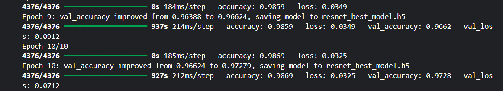
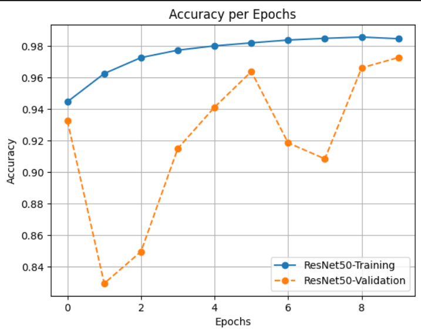
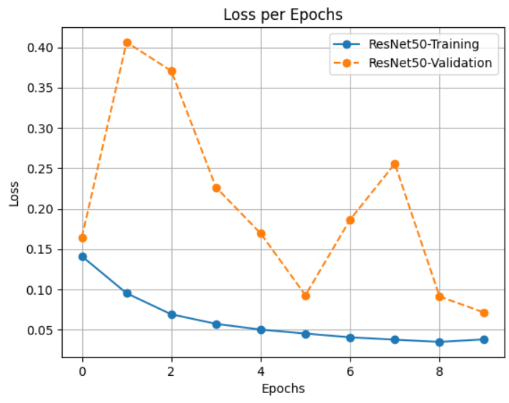
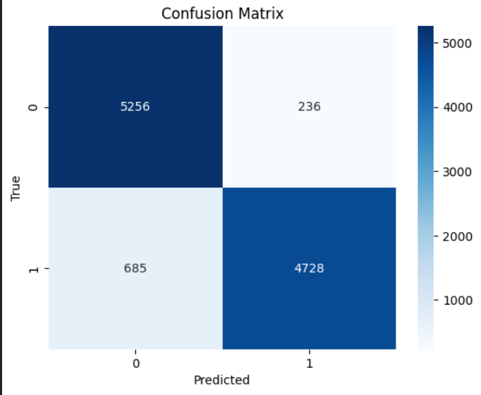
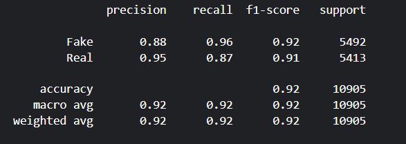
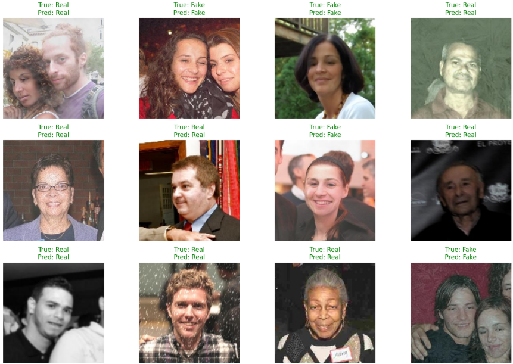

# 🕵️ DeepFake vs Real Image Classification with ResNet50

## 📌 Overview
This project implements a **binary image classification model** to distinguish between **Real and Fake (DeepFake) images** using **ResNet50** with transfer learning.  
The goal is to provide a reliable detection system that can be extended into real-world applications such as content verification and digital forensics.  

## 📂 Dataset

Source: [DeepFake and Real Images Dataset on Kaggle](https://www.kaggle.com/datasets/manjilkarki/deepfake-and-real-images).

The dataset is structured as follows:
  - **Train set:** Used for model training (with augmentation).  
  - **Validation set:** Used for hyperparameter tuning and early stopping.  
  - **Test set:** Used for final evaluation.

## ⚙️ Methodology

###  **Model Architecture**
- **Base Model:** ResNet50 (pretrained on ImageNet).  
- **Custom classification head:**
  - Global Average Pooling  
  - Dense (512, ReLU)  
  - Batch Normalization  
  - Dropout (0.3)  
  - Dense (1, Sigmoid)
 
###  **Training Strategy**
- Optimizer: `Adam`  
- Loss: `Binary Crossentropy`  
- Metrics: `Accuracy`  
- Callbacks:
  - **EarlyStopping:** patience = 5   
  - **ModelCheckpoint:** save best model (`ResNet_best_model.h5`)

## 📊 Results

### 1. Training 
  - Training accuracy: ~98.69%
  - Validation accuracy: ~97.28%
  - Loss: ~0.0712 (val)

    
**Loss and accuracy evolution over epochs.**  
| Accuracy | Loss |
|------------|------------|
|  |  |

### 2. Confusion Matrix 

### 3. Classification Report

### 4. Prediction Visualization
Random test samples with True vs Predicted labels highlighted:  
- ✅ Correct predictions in **green**  
- ❌ Wrong predictions in **red**

## 📌 Future Work
- Experiment with ConvNeXt or EfficientNet.
- Try data augmentation techniques like rotation, brightness, zoom.
- Deploy model as a web app with Flask/Streamlit.
